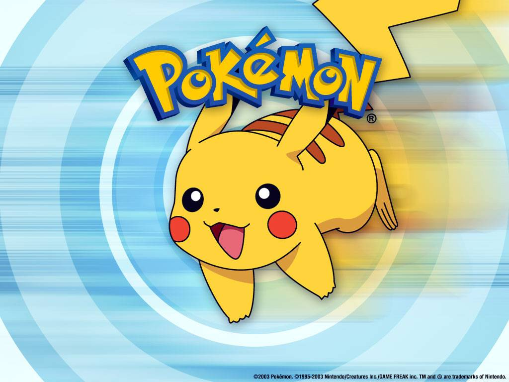
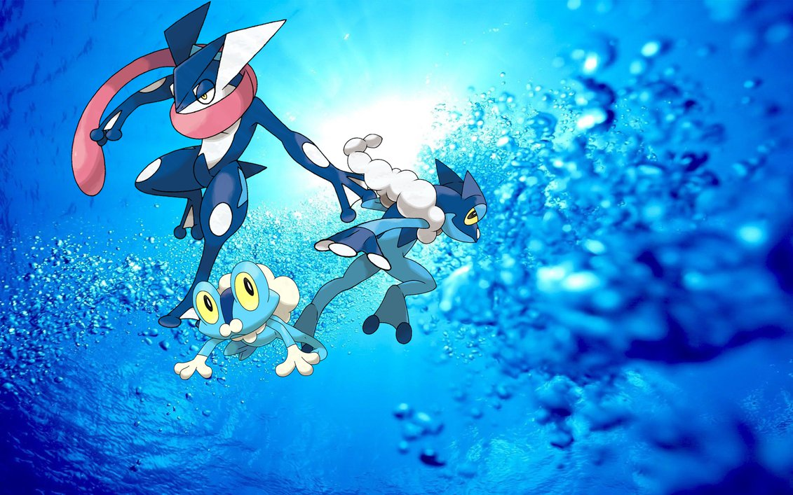
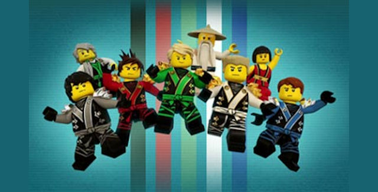

# ik

Hoi ik ben Noah/GreninjaAsh
Ik hou van...

ik vind charmander de leukste natuurlijk met al zijn evoluties!

Froakie staat op nummer2 met al zijn evoluties

mijn favoriete team song liedje [pokemon](https://www.youtube.com/watch?v=CQuObfTx6Cg)
kijk de film van [pokemon opkomst van darkrai](https://www.youtube.com/watch?v=ne26-P4byXI)
kijk ook seizoen1[pokemon seizoen1](https://www.youtube.com/watch?v=YwJu9sHqQ_k&list=PLV53TKZtH2Q8mjfNsBarnPicoRN8ID0tl)
als je meer pokemon wilt zien ga dan naar [pokemon.com](http://www.pokemon.com/us/pokemon-episodes/)
dan mee met de...[pikachu song](https://www.youtube.com/watch?v=sSMNKQl5DYo)
ok genoeg over pokemon, nu over ik

ik hou ook van 

er is in midels een nieuwe pokemon serie gekomen hij heet sun and moon
he over pokemon sun and moon ik laat jullie een aflevering zien [pokemon](https://www.youtube.com/watch?v=EI45Gh5q9AE)

einde

